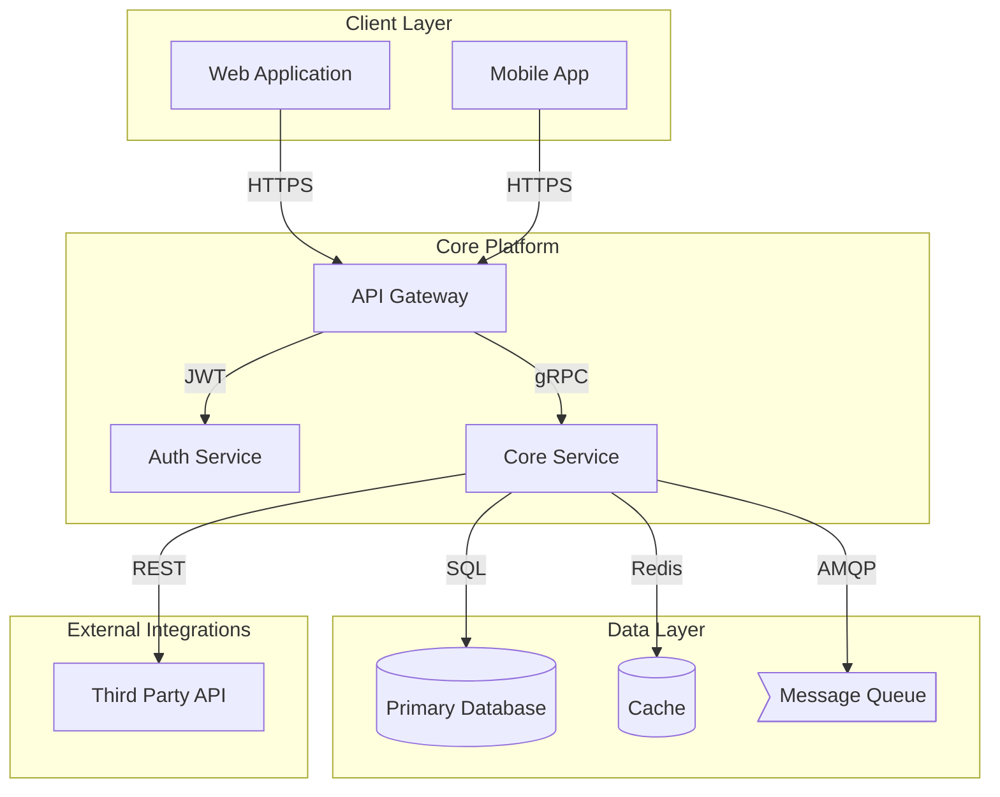

# Technical Architecture Reference

## Title
[Product/System Name] Technical Architecture

## Overview
Brief description of the system architecture and its purpose. Include the key architectural decisions and the overall approach (monolithic, microservices, serverless, etc.).

## Assumptions
- Assumption 1: [Description of assumption made due to incomplete information]
- Assumption 2: [Description of another assumption]

## Open Questions
- Question 1: [Unresolved question that needs stakeholder input]
- Question 2: [Another question requiring clarification]

---

## Components

### [Component Name]
- **ID:** [unique_lowercase_id using underscores]
- **Type:** [One of: client | gateway | service | worker | database | cache | queue | stream | ml_model | vector_db | idp | observability | external_system]
- **Responsibilities:**
  - Responsibility 1
  - Responsibility 2
  - Responsibility 3
- **Data Stores:** [List of data stores this component uses, or "None"]
- **Security Notes:**
  - Security consideration 1
  - Security consideration 2

[Repeat this section for each component in the system]

---

## Data Flows

### [Flow Name/Description]
- **From:** [source_component_id]
- **To:** [target_component_id]
- **Description:** [What data or requests flow between these components]
- **Protocol:** [HTTP/HTTPS | gRPC | WebSocket | AMQP | Kafka | GraphQL | REST | etc.]
- **Auth:** [OAuth2 | JWT | API Key | mTLS | Basic Auth | None | Not specified]
- **Data:**
  - Data type 1 (e.g., "User credentials")
  - Data type 2 (e.g., "Order details")

[Repeat this section for each significant data flow]

---

## Non-Functional Requirements

### Availability
[Describe availability requirements (e.g., 99.9% uptime, failover strategy) or state "Not specified"]

### Performance
[Describe performance requirements (e.g., <200ms response time, 1000 RPS) or state "Not specified"]

### Security
[Describe security requirements (e.g., encryption at rest, in transit, compliance requirements) or state "Not specified"]

### Compliance
[Describe compliance requirements (e.g., GDPR, HIPAA, SOC2) or state "Not specified"]

### Observability
[Describe observability requirements (e.g., logging, metrics, tracing, alerting) or state "Not specified"]

---

## Deployment View

### Environment
[Describe deployment environment (e.g., AWS, Azure, GCP, on-premises, hybrid) or state "Not specified"]

### Scaling Notes
- Scaling consideration 1 (e.g., "API Gateway scales horizontally based on request rate")
- Scaling consideration 2 (e.g., "Database uses read replicas for read-heavy workloads")

### Multi-Tenancy
[Describe multi-tenancy approach (e.g., "Shared infrastructure with tenant isolation via JWT claims") or state "Not specified"]

---

## Architecture Diagram

### Diagram Notes
- [Any additional notes about the architecture diagram]
- [Explanation of design decisions shown in the diagram]
